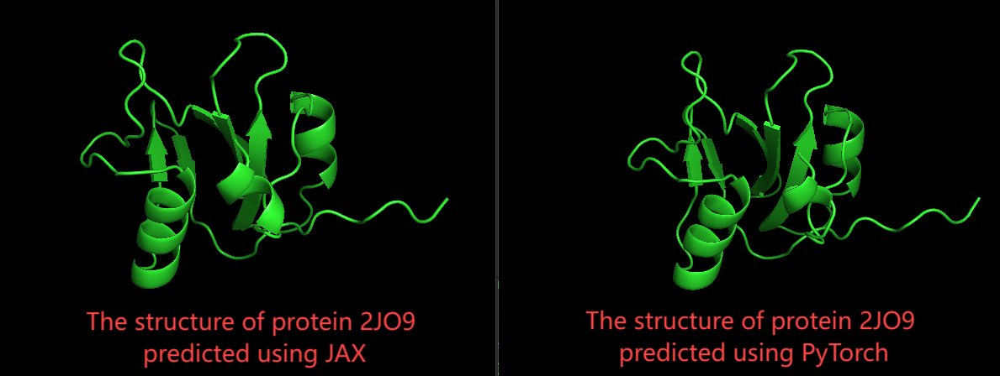

# AlphaFold3 Torch CPU
This repository is a fork from Alphafold3, which mainly replaces the code of the **core model part** with **torch** (other parts still retain the jax implementation), to solve the problem of low jax parallel efficiency on Intel series CPUs, and is only used for communication and learning purposes.

If you are looking for a more complete torch implementation of Alphafold 3, please move to [xFold](https://github.com/Shenggan/xfold/tree/main). This repository is a wonderful job, migrating all jax components to the torch framework with better precision control.


This repository maintaining compatibility with **official parameters**, controlling the accuracy loss within **10%** in all test cases. 
A example for predicting the protein '2JO9' :


The code has been validated on the following platform:  
```  
Ubuntu 18.04  
Intel(R) Xeon(R) Gold 5320 CPU x 2  
RAM 377GB  
```  

### Implementation Details  
**Torch Migration**  
- All migrated components are denoted with `_th` suffixes.  
- Full migration of JAX components in `alphafold3_torch/src/alphafold3/model/diffusion` to PyTorch.  
- Input/output processing retains the original JAX implementation for compatibility.  


### Build Enviorment
The installation steps before here is the same as the AF3 official repository: [Alphafold3](https://github.com/google-deepmind/alphafold3)
```bash
conda create -n iaf3 python=3.11
conda activate iaf3

# install alphafold requirements
python -m pip install -r requirements.txt
python -c "import jax; print(jax.__version__)"

# install torch scatter and torch sparse for scatter accerlation
python -m pip install torch_sparse==0.6.18
python -m pip install torch_scatter==2.1.2
python -c "import torch; import torch_scatter;"

# install intel extension for torch
python -m pip install intel-extension-for-pytorch==2.5.0
python -m pip install oneccl_bind_pt==2.5.0 --extra-index-url https://pytorch-extension.intel.com/release-whl/stable/cpu/us/
python -c "import torch; import intel_extension_for_pytorch as ipex; print(torch.__version__); print(ipex.__version__);"

# install alphafold3 packages
# the script is tested in gcc-11
cd alphafold3_troch
CC=gcc CXX=g++ python -m pip install -e .

# Build chemical components database
build_data
```
---
### Run scripts

performance tips:
```bash
export IPEX='true' # enable Intel extension for pytorch
export BATCH='true' # use batch mode for diffusion multi-num sample instead of vmap (a little bit faster)
```

Run pure torch script:
```bash
# for example
# export INPUT_JSON=~/processed/37aa_2JO9.json
# export MODEL_DIR=~/models
# export OUTPUT_PATH=~/outputs

python run_alphafold_th.py \ 
    --json_path "$INPUT_JSON" \
    --model_dir $MODEL_DIR \
    --output_dir "$OUTPUT_PATH" \
    --compile # enable torch.compile for faster sampling
```